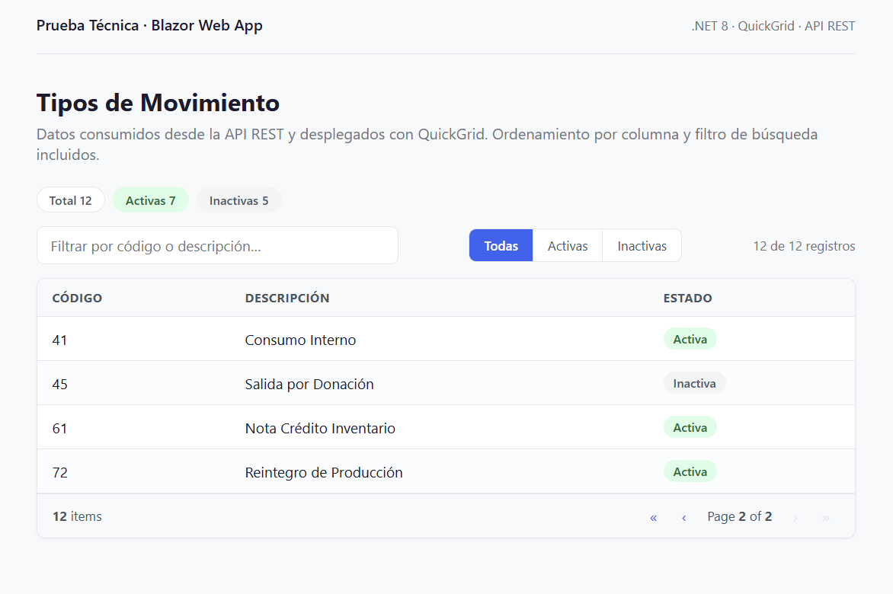

# Prueba Técnica — Blazor Web App

Aplicación en **Blazor Web App (.NET 8)** que consume una API REST y despliega los
tipos de movimiento en una grilla interactiva con ordenamiento y filtro de búsqueda.

## Cómo ejecutar

Requisitos: .NET SDK 8.0+

```bash
dotnet restore

# Terminal 1 — API mock (mientras se confirma la URL de la API real)
dotnet run --project PruebaTecnica.MockApi     # http://localhost:5200

# Terminal 2 — Aplicación web
dotnet run --project PruebaTecnica.Web         # http://localhost:5100

# Tests
dotnet test
```

## Captura



## Nota sobre la API

El correo de la prueba menciona "la siguiente API REST", pero la URL del endpoint
no venía incluida en el mensaje. Se solicitó al equipo reclutador el mismo día
(domingo 20 de julio) y, para no detener el desarrollo, se construyó
`PruebaTecnica.MockApi`: un Minimal API que replica exactamente la estructura JSON
del ejemplo del correo.

**Conectar la API real requiere únicamente editar `PruebaTecnica.Web/appsettings.json`:**

```json
"Api": {
  "BaseUrl": "https://url-real-de-la-api.com",
  "MovimientosEndpoint": "ruta/del/endpoint"
}
```

Ninguna línea de código cambia: la URL nunca está hardcodeada.

## Decisiones técnicas

| Decisión | Razón |
|---|---|
| Blazor Web App (.NET 8), Interactive Server | Template actual del framework; render server evita complejidad de CORS/payload innecesaria para este alcance |
| QuickGrid | Componente de grilla oficial de Microsoft: sin dependencias de terceros ni licencias |
| `HttpClient` tipado + `IHttpClientFactory` | Patrón correcto de inyección; evita agotamiento de sockets del `new HttpClient()` manual |
| `Resultado<T>` en el servicio | La UI nunca recibe excepciones crudas; errores de red, timeout y formato se traducen a mensajes claros |
| Estados de UI: cargando / error+reintento / vacío | Comportamiento robusto ante fallas de la API, no solo el camino feliz |
| `record` para el modelo | Inmutabilidad idiomática de C# moderno |
| Tests con `HttpMessageHandler` falso | El servicio se prueba sin red: éxito, lista vacía, error HTTP y JSON inválido |
| Sin capas extra (MediatR, CQRS, etc.) | El alcance es una pantalla: la arquitectura mínima correcta es criterio, no falta de conocimiento |

## Uso de herramientas de IA

Este proyecto se desarrolló con un workflow de IA asistida de dos niveles, con
revisión humana en cada paso:

**Claude (diseño y arquitectura):** definición del plan técnico, decisiones de
arquitectura (render mode, QuickGrid, HttpClient tipado, manejo de errores con
resultado tipado) y generación del scaffold inicial completo de la solución,
incluyendo los tests.

**Claude Code (verificación e iteración local):** compilación, ejecución de la
suite de tests, corrección mínima de errores (una línea: un `@using static`
faltante en `_Imports.razor`), verificación de ambos servicios en ejecución y
gestión del repositorio con commits atómicos.

**CLAUDE.md como contrato:** el repositorio incluye un archivo `CLAUDE.md` con
las reglas no negociables del proyecto (URL solo en configuración, prohibición
de `new HttpClient()`, estados de UI obligatorios, sin sobre-ingeniería). Esto
mantiene consistencia entre sesiones y entre herramientas de IA.

**Control humano:** cada cambio generado fue revisado antes de commitearse; los
tests unitarios actúan como red de seguridad para validar que el código generado
cumple el contrato de la API. La IA aceleró la ejecución; las decisiones de
diseño y la validación final fueron humanas.

## Estructura

```
PruebaTecnica.Web/       Blazor Web App (UI + servicio + modelo)
PruebaTecnica.MockApi/   Minimal API mock (temporal)
PruebaTecnica.Tests/     xUnit
```
